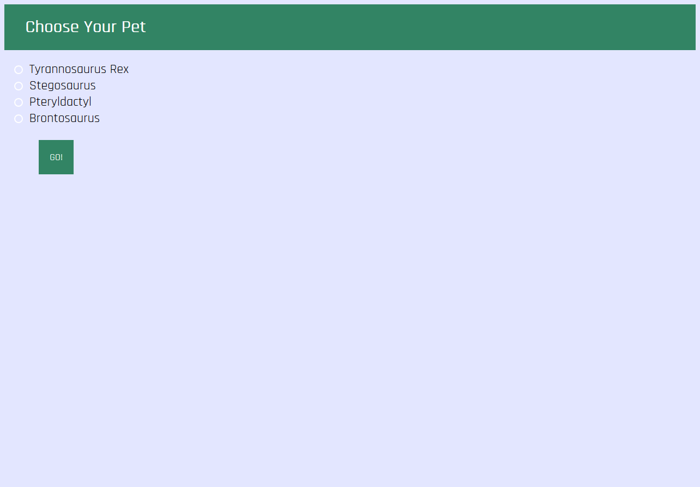

# Dino-pets

Links: 

https://beccaww.github.io/dino-pet/public/index.html

https://whispering-scrubland-42616.herokuapp.com/

Summary: 

Dino-pet is a virtual pet with dinosaurs. Create a dinosaur and raise it from an egg into a full grown dinosaur. Interact with
the egg and the full grown dinosaur through buttons on your screen. 

Technologies used: 

HTML, CSS, JavaScript, jQuery, Node.js

Screenshots:

.png)
.png)
.png)
.png)
