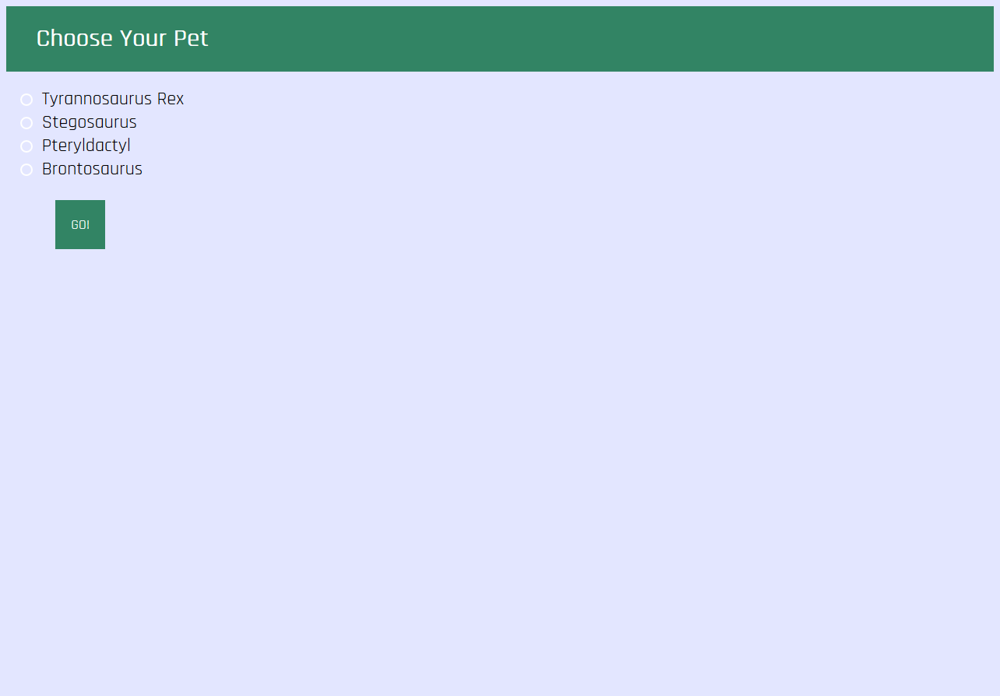

# Dino-pets

Link: 

Summary: Dino-pet is a virtual pet with dinosaurs. Create a dinosaur and raise it from an egg into a full grown dinosaur. Interact with
the egg and the full grown dinosaur through buttons on your screen. 

Technologies used: HTML, CSS, JavaScript, jQuery, Node.js

Screenshots:

.png)

.png)

.png)

.png)
